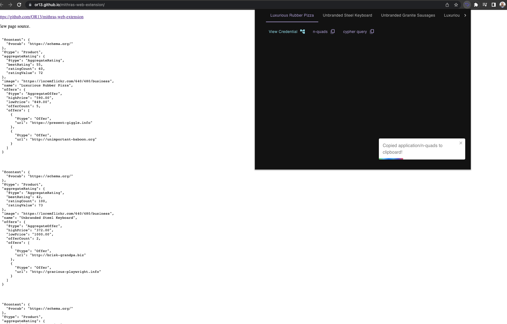
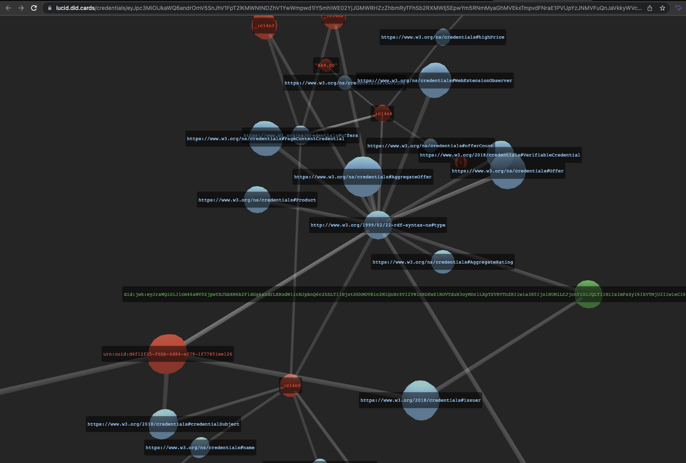

# Mithras Web Extension

#### [Questions? Contact Transmute](https://transmute.typeform.com/to/RshfIw?typeform-source=did-eqt)

#### 🚧 Warning Experimental 🔥

This repo contains web extension experiments related to JSON-LD, Verifiable Credentials and Decentralized Identifiers.

The popup exposes options related to the linked data fragments gatherd from the current active tab.

View a fragments as a 3d graph after issuing it as a verifiable credential:

### Developers

See [template-readme.md](./template-readme.md)
