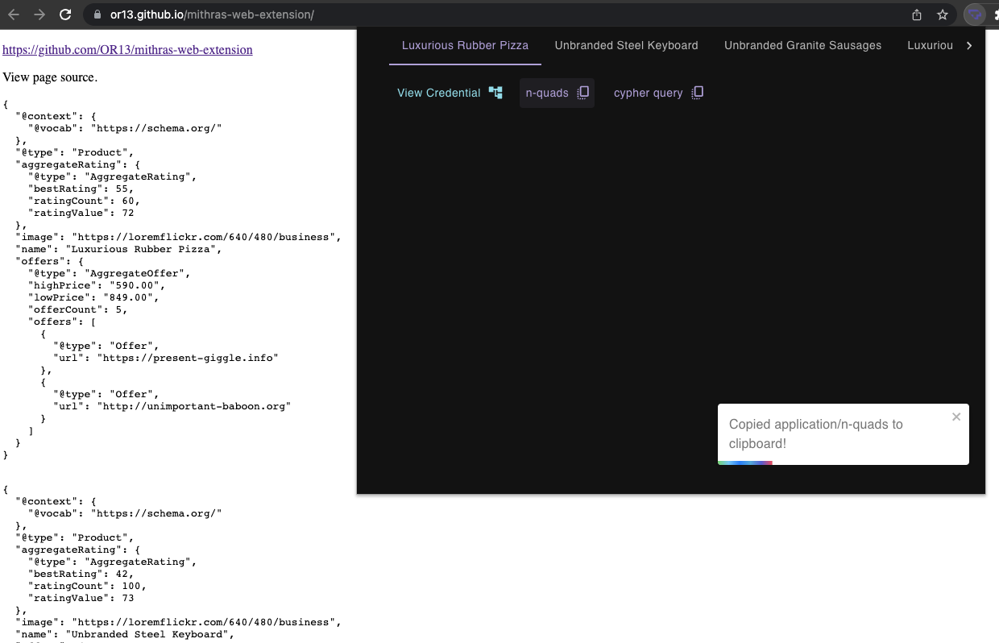

# Mithras Web Extension


#### [Questions? Contact Transmute](https://transmute.typeform.com/to/RshfIw?typeform-source=did-eqt)

#### 🚧 Warning Experimental 🔥

This repo contains web extension experiments related to JSON-LD, Verifiable Credentials and Decentralized Identifiers.


The popup exposes options related to the linked data fragments gatherd from the current active tab.



View a fragments as a 3d graph after issuing it as a verifiable credential:


Example cypher query:

```cypher
CREATE ( g:NamedGraph { uri: "urn:uuid:8c38171b-e362-4b59-b029-7f2d9e27f69f" } )
MERGE ( n0 :Resource { uri: "<urn:uuid:8c38171b-e362-4b59-b029-7f2d9e27f69f:_:c14n0>", image: "https://loremflickr.com/640/480/business" ., name: "Luxurious Rubber Pizza" ., rdf_keys: ['<https://schema.org/image>','<https://schema.org/name>'], rdf_values: ['"https://loremflickr.com/640/480/business" .','"Luxurious Rubber Pizza" .'] } )
CREATE (g)-[r0: FROM_NAMED_GRAPH ]->(n0)
MERGE ( n1 :Resource { uri: "<http://www.w3.org/1999/02/22-rdf-syntax-ns#type>" } )
CREATE (g)-[r1: FROM_NAMED_GRAPH ]->(n1)
MERGE ( n2 :Resource { uri: "<https://schema.org/Product> ." } )
CREATE (g)-[r2: FROM_NAMED_GRAPH ]->(n2)
MERGE ( n3 :Resource { uri: "<https://schema.org/aggregateRating>" } )
CREATE (g)-[r3: FROM_NAMED_GRAPH ]->(n3)
MERGE ( n4 :Resource { uri: "<urn:uuid:8c38171b-e362-4b59-b029-7f2d9e27f69f:_:c14n1 .>" } )
CREATE (g)-[r4: FROM_NAMED_GRAPH ]->(n4)
MERGE ( n5 :Resource { uri: "<https://schema.org/image>" } )
CREATE (g)-[r5: FROM_NAMED_GRAPH ]->(n5)
MERGE ( n6 :Resource { uri: "<https://schema.org/name>" } )
CREATE (g)-[r6: FROM_NAMED_GRAPH ]->(n6)
MERGE ( n7 :Resource { uri: "<https://schema.org/offers>" } )
CREATE (g)-[r7: FROM_NAMED_GRAPH ]->(n7)
MERGE ( n8 :Resource { uri: "<urn:uuid:8c38171b-e362-4b59-b029-7f2d9e27f69f:_:c14n3 .>" } )
CREATE (g)-[r8: FROM_NAMED_GRAPH ]->(n8)
MERGE ( n9 :Resource { uri: "<urn:uuid:8c38171b-e362-4b59-b029-7f2d9e27f69f:_:c14n1>", bestRating: 55, ratingCount: 60, ratingValue: 72, rdf_keys: ['<https://schema.org/bestRating>','<https://schema.org/ratingCount>','<https://schema.org/ratingValue>'], rdf_values: ['"55"^^<http://www.w3.org/2001/XMLSchema#integer> .','"60"^^<http://www.w3.org/2001/XMLSchema#integer> .','"72"^^<http://www.w3.org/2001/XMLSchema#integer> .'] } )
CREATE (g)-[r9: FROM_NAMED_GRAPH ]->(n9)
MERGE ( n10 :Resource { uri: "<https://schema.org/AggregateRating> ." } )
CREATE (g)-[r10: FROM_NAMED_GRAPH ]->(n10)
MERGE ( n11 :Resource { uri: "<https://schema.org/bestRating>" } )
CREATE (g)-[r11: FROM_NAMED_GRAPH ]->(n11)
MERGE ( n12 :Resource { uri: "<https://schema.org/ratingCount>" } )
CREATE (g)-[r12: FROM_NAMED_GRAPH ]->(n12)
MERGE ( n13 :Resource { uri: "<https://schema.org/ratingValue>" } )
CREATE (g)-[r13: FROM_NAMED_GRAPH ]->(n13)
MERGE ( n14 :Resource { uri: "<urn:uuid:8c38171b-e362-4b59-b029-7f2d9e27f69f:_:c14n2>", url: "https://present-giggle.info" ., rdf_keys: ['<https://schema.org/url>'], rdf_values: ['"https://present-giggle.info" .'] } )
CREATE (g)-[r14: FROM_NAMED_GRAPH ]->(n14)
MERGE ( n15 :Resource { uri: "<https://schema.org/Offer> ." } )
CREATE (g)-[r15: FROM_NAMED_GRAPH ]->(n15)
MERGE ( n16 :Resource { uri: "<https://schema.org/url>" } )
CREATE (g)-[r16: FROM_NAMED_GRAPH ]->(n16)
MERGE ( n17 :Resource { uri: "<urn:uuid:8c38171b-e362-4b59-b029-7f2d9e27f69f:_:c14n3>", highPrice: "590.00" ., lowPrice: "849.00" ., offerCount: 5, rdf_keys: ['<https://schema.org/highPrice>','<https://schema.org/lowPrice>','<https://schema.org/offerCount>'], rdf_values: ['"590.00" .','"849.00" .','"5"^^<http://www.w3.org/2001/XMLSchema#integer> .'] } )
CREATE (g)-[r17: FROM_NAMED_GRAPH ]->(n17)
MERGE ( n18 :Resource { uri: "<https://schema.org/AggregateOffer> ." } )
CREATE (g)-[r18: FROM_NAMED_GRAPH ]->(n18)
MERGE ( n19 :Resource { uri: "<https://schema.org/highPrice>" } )
CREATE (g)-[r19: FROM_NAMED_GRAPH ]->(n19)
MERGE ( n20 :Resource { uri: "<https://schema.org/lowPrice>" } )
CREATE (g)-[r20: FROM_NAMED_GRAPH ]->(n20)
MERGE ( n21 :Resource { uri: "<https://schema.org/offerCount>" } )
CREATE (g)-[r21: FROM_NAMED_GRAPH ]->(n21)
MERGE ( n22 :Resource { uri: "<urn:uuid:8c38171b-e362-4b59-b029-7f2d9e27f69f:_:c14n2 .>" } )
CREATE (g)-[r22: FROM_NAMED_GRAPH ]->(n22)
MERGE ( n23 :Resource { uri: "<urn:uuid:8c38171b-e362-4b59-b029-7f2d9e27f69f:_:c14n4 .>" } )
CREATE (g)-[r23: FROM_NAMED_GRAPH ]->(n23)
MERGE ( n24 :Resource { uri: "<urn:uuid:8c38171b-e362-4b59-b029-7f2d9e27f69f:_:c14n4>", url: "http://unimportant-baboon.org" ., rdf_keys: ['<https://schema.org/url>'], rdf_values: ['"http://unimportant-baboon.org" .'] } )
CREATE (g)-[r24: FROM_NAMED_GRAPH ]->(n24)
CREATE (n0)-[e0: FROM_NAMED_GRAPH_EDGE ]->(n1)
CREATE (n1)-[e1: FROM_NAMED_GRAPH_EDGE ]->(n2)
CREATE (n0)-[e2: FROM_NAMED_GRAPH_EDGE ]->(n3)
CREATE (n3)-[e3: FROM_NAMED_GRAPH_EDGE ]->(n4)
CREATE (n0)-[e4: FROM_NAMED_GRAPH_EDGE ]->(n5)
CREATE (n0)-[e5: FROM_NAMED_GRAPH_EDGE ]->(n6)
CREATE (n0)-[e6: FROM_NAMED_GRAPH_EDGE ]->(n7)
CREATE (n7)-[e7: FROM_NAMED_GRAPH_EDGE ]->(n8)
CREATE (n9)-[e8: FROM_NAMED_GRAPH_EDGE ]->(n1)
CREATE (n1)-[e9: FROM_NAMED_GRAPH_EDGE ]->(n10)
CREATE (n9)-[e10: FROM_NAMED_GRAPH_EDGE ]->(n11)
CREATE (n9)-[e11: FROM_NAMED_GRAPH_EDGE ]->(n12)
CREATE (n9)-[e12: FROM_NAMED_GRAPH_EDGE ]->(n13)
CREATE (n14)-[e13: FROM_NAMED_GRAPH_EDGE ]->(n1)
CREATE (n1)-[e14: FROM_NAMED_GRAPH_EDGE ]->(n15)
CREATE (n14)-[e15: FROM_NAMED_GRAPH_EDGE ]->(n16)
CREATE (n17)-[e16: FROM_NAMED_GRAPH_EDGE ]->(n1)
CREATE (n1)-[e17: FROM_NAMED_GRAPH_EDGE ]->(n18)
CREATE (n17)-[e18: FROM_NAMED_GRAPH_EDGE ]->(n19)
CREATE (n17)-[e19: FROM_NAMED_GRAPH_EDGE ]->(n20)
CREATE (n17)-[e20: FROM_NAMED_GRAPH_EDGE ]->(n21)
CREATE (n17)-[e21: FROM_NAMED_GRAPH_EDGE ]->(n7)
CREATE (n7)-[e22: FROM_NAMED_GRAPH_EDGE ]->(n22)
CREATE (n17)-[e23: FROM_NAMED_GRAPH_EDGE ]->(n7)
CREATE (n7)-[e24: FROM_NAMED_GRAPH_EDGE ]->(n23)
CREATE (n24)-[e25: FROM_NAMED_GRAPH_EDGE ]->(n1)
CREATE (n1)-[e26: FROM_NAMED_GRAPH_EDGE ]->(n15)
CREATE (n24)-[e27: FROM_NAMED_GRAPH_EDGE ]->(n16)
RETURN n0,n1,n2,n3,n4,n5,n6,n7,n8,n9,n10,n11,n12,n13,n14,n15,n16,n17,n18,n19,n20,n21,n22,n23,n24
```

### Developers

See [template-readme.md](./template-readme.md)
